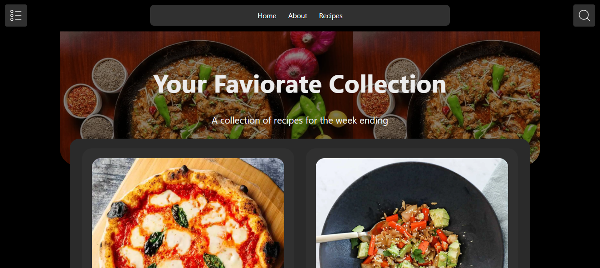

# Recipe Sharing App

A modern **Recipe Sharing Application** built with **React** that allows users to explore recipes, search smoothly, and view detailed cooking information. The app uses **Context API** for global state management and follows clean architecture principles.


---

## Features

- Browse a list of delicious recipes
- Smooth debounced search functionality
- Fast and responsive UI
- Data fetched from a public Recipe API
- Global state management using Context API
- Clean component-based architecture
- Modern UI with dark theme styling

---

## Tech Stack

- **React**
- **React Router**
- **Context API**
- **SCSS**
- **JavaScript (ES6+)**
- **Fetch API**

---

## Project Structure

```text
src/
│── context/
│   └── Context.js
│
│── pages/
│   ├── Home/
│   ├── About/
│   └── RecipeDetails/
│
│── components/
│   ├── Loading/
│   └── Navbar/
│
│── App.jsx
│── main.jsx
```

---

## 🚀 Getting Started

### 1️⃣ Clone the repository

```bash
git clone https://github.com/asifmeer55766/recipe-app.git
```

### 2️⃣ Install dependencies

```bash
npm install
```

### 3️⃣ Run the app

```bash
npm run dev
```

The app will run on:

```
http://localhost:5173
```

---

## Search Functionality

- Search is **debounced** to improve performance
- Filters recipes based on name
- Clearing the search input restores all recipes

---

## State Management

- Context API is used to:
  - Fetch recipe data
  - Store global state
  - Handle loading state
  - Manage search logic

---

## API Used

- Public Recipe API

  ```
  https://dummyjson.com/recipes
  ```

---

## Styling

- SCSS is used for styling
- Green and orange accent colors for headings and highlights

## Future Improvements

- Favorites feature
- User authentication
- Advanced filters (difficulty, cuisine)
- Lazy loading for pages
- Server-side search

---

## Contributing

Contributions are welcome!
Feel free to fork the repo and submit a pull request.

---

## License

This project is open-source and available under the **MIT License**.

---

## Author

Built with ❤️ by **Asif Hussain**
